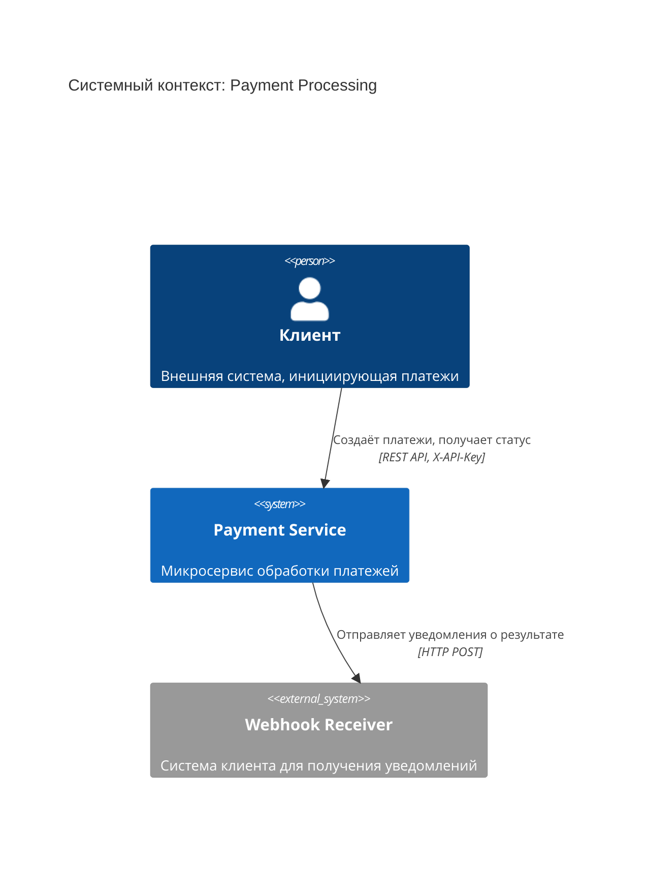
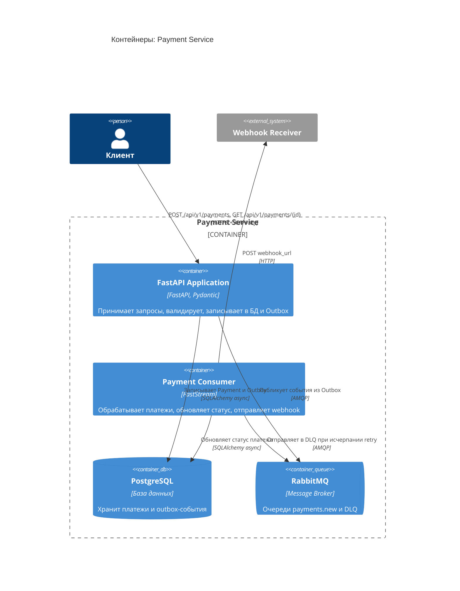
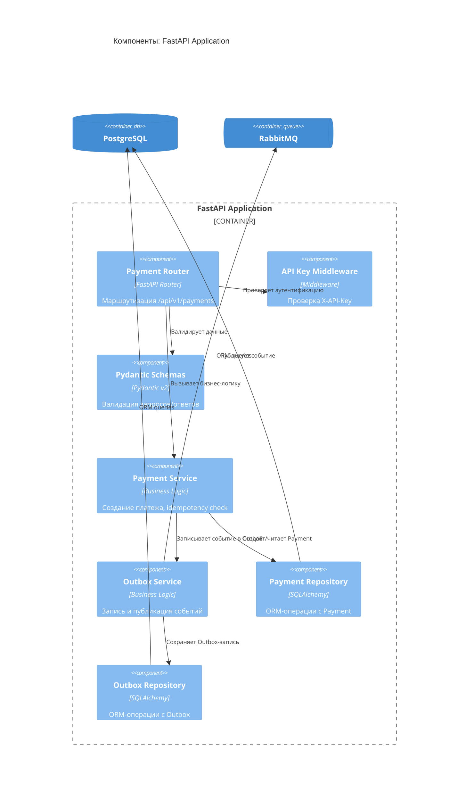
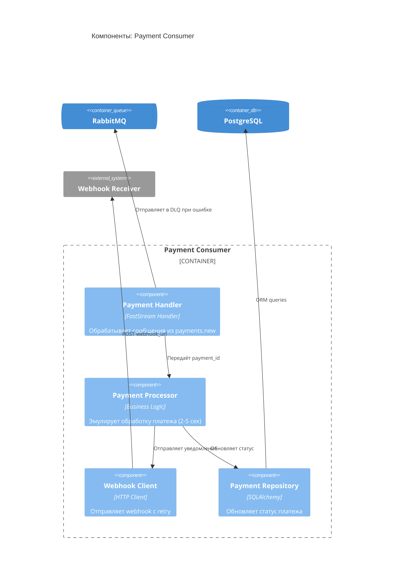

# Архитектура: Payment Processing Microservice

## L1 — Системный контекст

Микросервис обработки платежей взаимодействует с внешними клиентами через REST API и отправляет webhook-уведомления о результатах обработки.

**Актёры:**
- **Клиент** — внешняя система, создающая платежи через API
- **Webhook Receiver** — система клиента, принимающая уведомления о результатах

**Границы системы:**
- Вход: REST API с аутентификацией по X-API-Key
- Выход: HTTP webhook на URL, указанный клиентом

## L2 — Контейнеры

Микросервис состоит из API-приложения, consumer-воркера, базы данных и брокера сообщений.

**Компоненты:**
- **FastAPI Application** — REST API, валидация, запись в БД
- **Payment Consumer** — асинхронная обработка, webhook-отправка
- **PostgreSQL** — хранение платежей и outbox-событий
- **RabbitMQ** — брокер сообщений с DLQ

**Потоки данных:**
1. API → DB: запись Payment + Outbox (транзакция)
2. API → MQ: публикация события из Outbox
3. Consumer ← MQ: получение события
4. Consumer → DB: обновление статуса
5. Consumer → Webhook: уведомление клиента

## L3 — Компоненты

Детализация внутренней структуры FastAPI Application и Payment Consumer.

### FastAPI Application

**Слои:**
- **Presentation** — Router, Middleware, Schemas
- **Business Logic** — Payment Service, Outbox Service
- **Data Access** — Repositories (Payment, Outbox)

**Ключевые компоненты:**
- **API Key Middleware** — проверяет X-API-Key для всех запросов
- **Payment Service** — проверяет idempotency key, создаёт платёж
- **Outbox Service** — реализует Outbox pattern (запись + публикация)

### Payment Consumer

**Ключевые компоненты:**
- **Payment Handler** — FastStream subscriber на очередь payments.new
- **Payment Processor** — эмулирует обработку (90% успех, 10% fail)
- **Webhook Client** — отправка с retry (3 попытки, exponential backoff)

**Обработка ошибок:**
- Retry на уровне RabbitMQ (3 попытки)
- Dead Letter Queue для невосстановимых сообщений
- Exponential backoff для webhook (1s, 2s, 4s)

## Архитектурные слои

| Слой | Назначение | Компоненты |
|------|------------|------------|
| **Presentation** | HTTP API, валидация | Router, Middleware, Schemas |
| **Business Logic** | Бизнес-правила, оркестрация | Services (Payment, Outbox, Processor) |
| **Data Access** | Работа с БД | Repositories (SQLAlchemy) |
| **Infrastructure** | Внешние системы | RabbitMQ, HTTP Client |

## Паттерны проектирования

### Outbox Pattern
- Запись события в таблицу `outbox` в той же транзакции, что и `payment`
- Отдельный процесс публикует события из `outbox` в RabbitMQ
- Гарантирует at-least-once delivery

### Repository Pattern
- Инкапсуляция ORM-операций
- Упрощение тестирования (mock repositories)

### Idempotency
- Проверка `idempotency_key` перед созданием платежа
- Возврат существующего платежа при повторном запросе

### Retry with Exponential Backoff
- 3 попытки отправки webhook
- Задержки: 1s, 2s, 4s
- Dead Letter Queue после исчерпания попыток

## Масштабирование

**Горизонтальное:**
- API: несколько инстансов за load balancer
- Consumer: несколько воркеров на одной очереди (competing consumers)

**Вертикальное:**
- PostgreSQL: индексы на `idempotency_key`, `status`, `created_at`
- RabbitMQ: prefetch_count для контроля нагрузки

## Безопасность

- **Аутентификация:** статический X-API-Key (переменная окружения)
- **Валидация:** Pydantic schemas для всех входных данных
- **Secrets:** все чувствительные данные в environment variables
- **HTTPS:** для production (в ТЗ не указано, но рекомендуется)

## Мониторинг и наблюдаемость

**Логирование:**
- Структурированные логи (JSON)
- Уровни: INFO для бизнес-событий, ERROR для ошибок
- Correlation ID для трейсинга запросов

**Метрики (рекомендуется):**
- Количество созданных платежей
- Распределение статусов (succeeded/failed)
- Время обработки платежа
- Количество retry webhook
- Размер DLQ

**Health checks:**
- `/health` — проверка доступности API
- Проверка подключения к PostgreSQL и RabbitMQ
