# Поведение: Payment Processing Microservice

## Use Case 1: Создание платежа (успешный сценарий)

**Актор:** Внешний клиент
**Предусловие:** Клиент имеет валидный X-API-Key
**Цель:** Создать новый платёж и получить подтверждение приёма

### Happy path

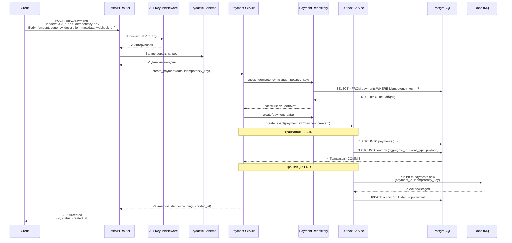

### Ошибки и edge cases

#### 1.1 Невалидный X-API-Key

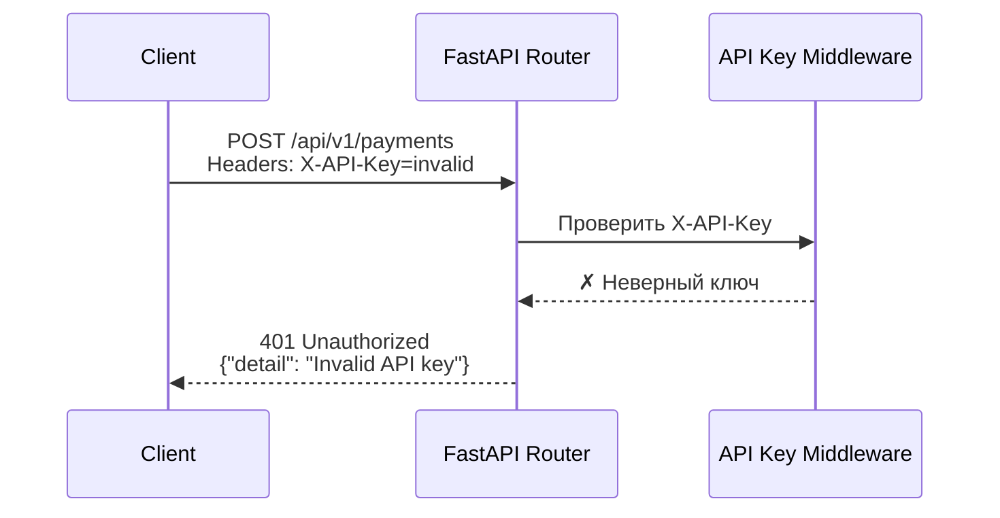

#### 1.2 Невалидные данные запроса

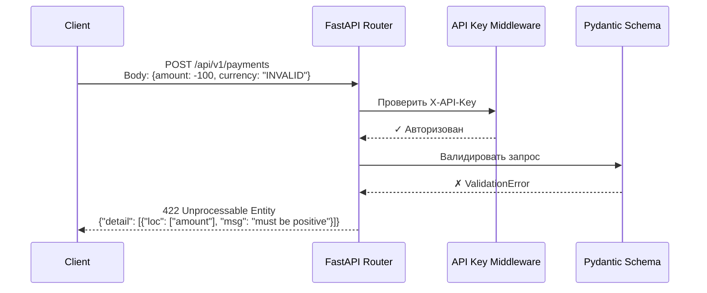

#### 1.3 Повторный запрос с тем же Idempotency-Key

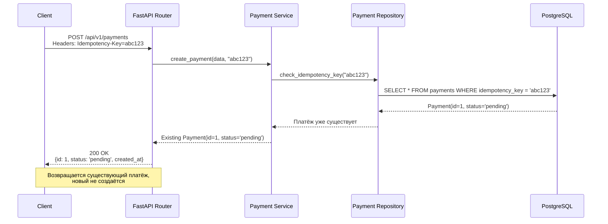

#### 1.4 Ошибка публикации в RabbitMQ

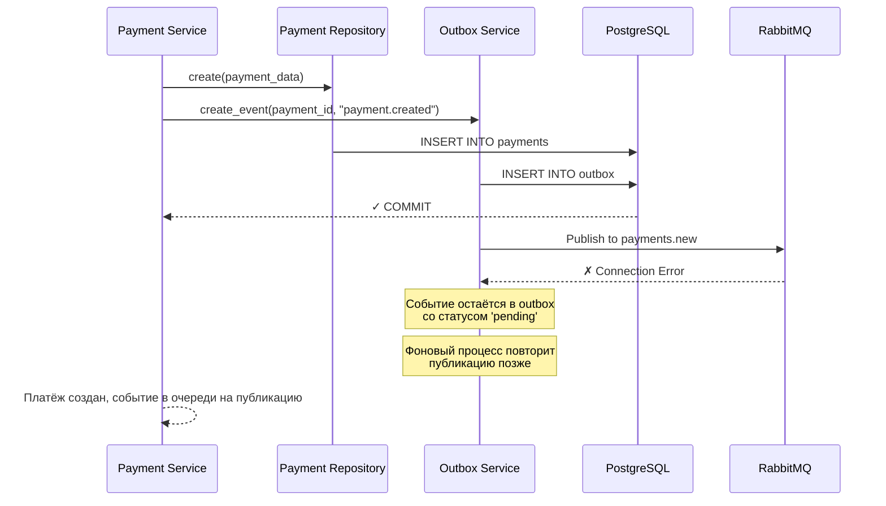

---

## Use Case 2: Получение информации о платеже

**Актор:** Внешний клиент
**Предусловие:** Клиент имеет валидный X-API-Key и payment_id
**Цель:** Получить актуальный статус платежа

### Happy path

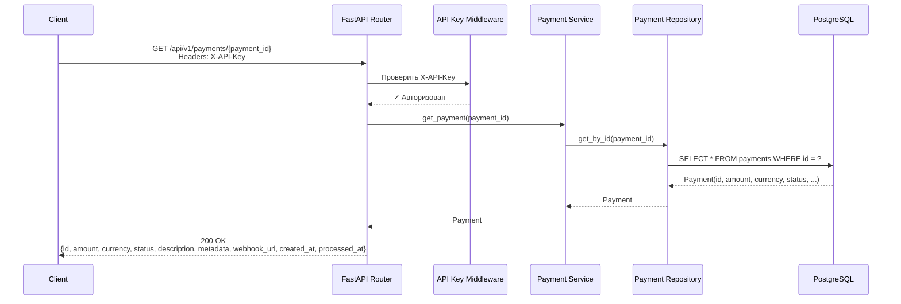

### Ошибки и edge cases

#### 2.1 Платёж не найден

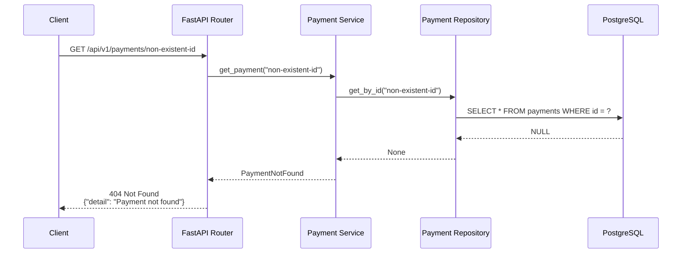

---

## Use Case 3: Обработка платежа (Consumer)

**Актор:** Payment Consumer
**Предусловие:** Событие опубликовано в очередь payments.new
**Цель:** Обработать платёж, обновить статус, отправить webhook

### Happy path

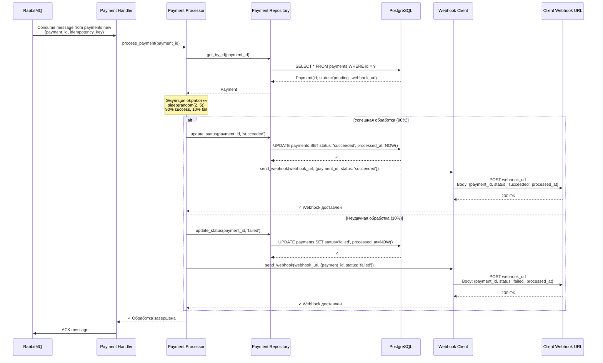

### Ошибки и edge cases

#### 3.1 Ошибка отправки webhook (с retry)

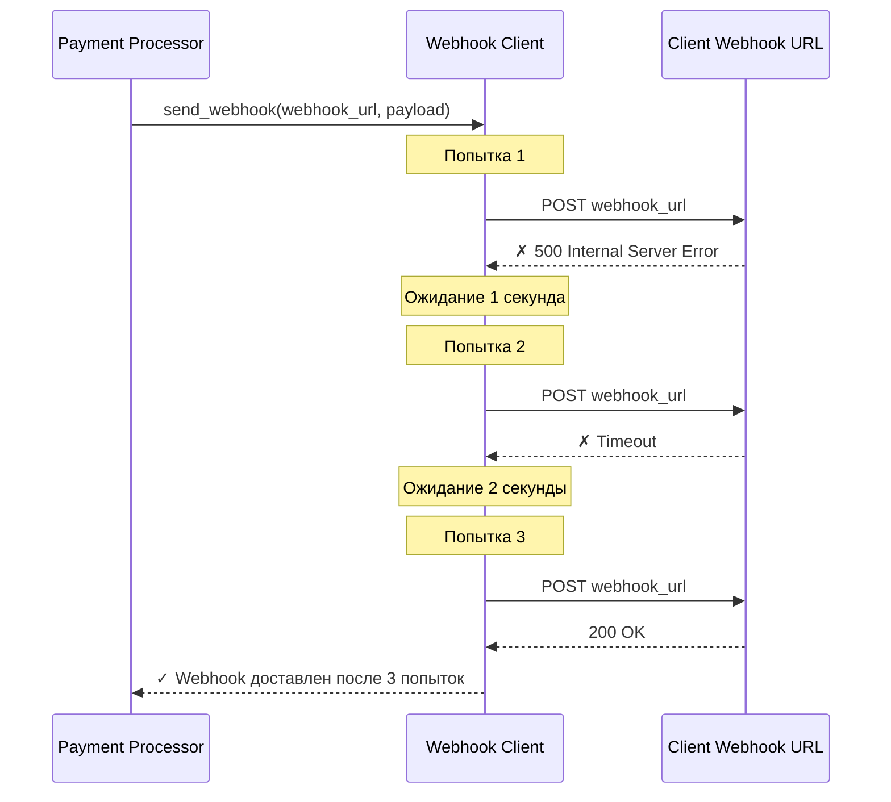

#### 3.2 Исчерпание retry и отправка в DLQ

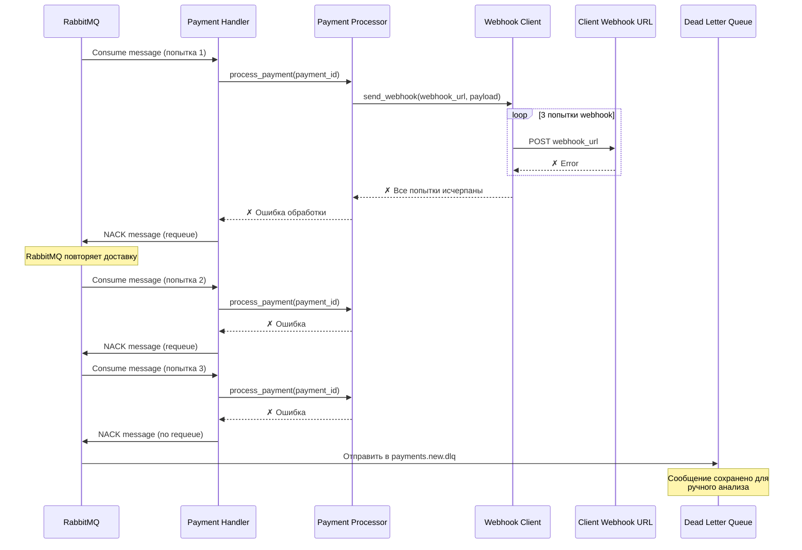

#### 3.3 Платёж уже обработан (идемпотентность consumer)

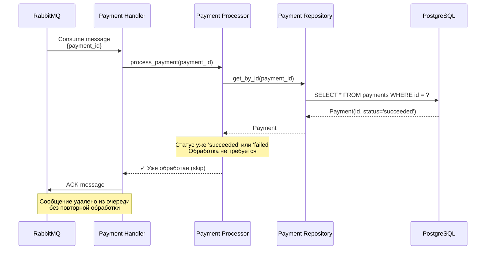

---

## Use Case 4: Публикация событий из Outbox (фоновый процесс)

**Актор:** Outbox Publisher (фоновая задача)
**Предусловие:** Есть неопубликованные события в таблице outbox
**Цель:** Гарантировать публикацию всех событий в RabbitMQ

### Happy path

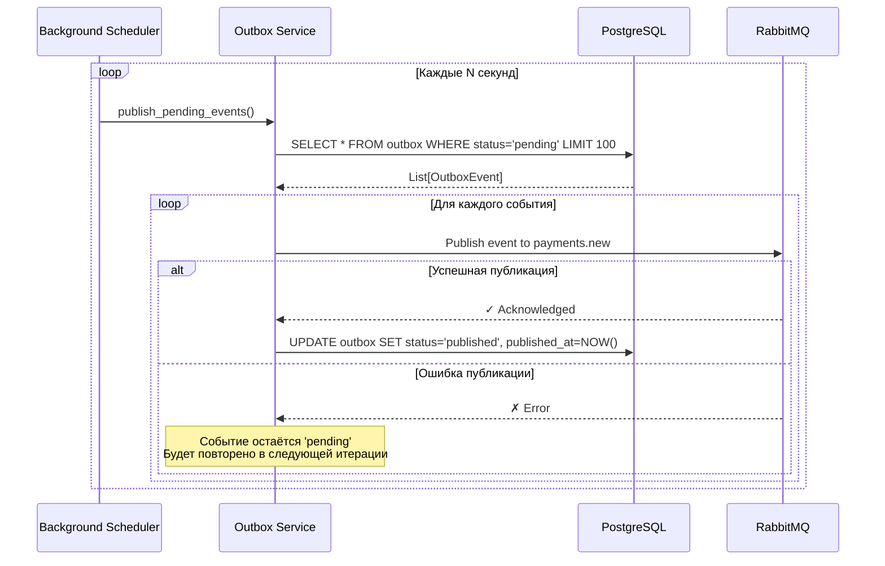

### Ошибки и edge cases

#### 4.1 RabbitMQ недоступен

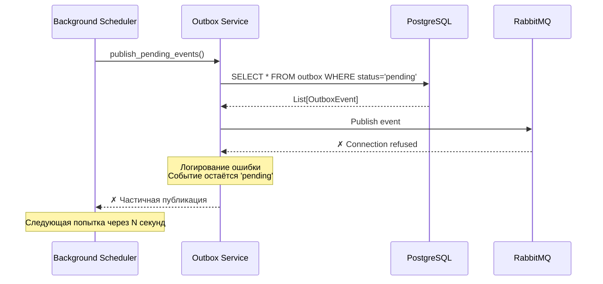
