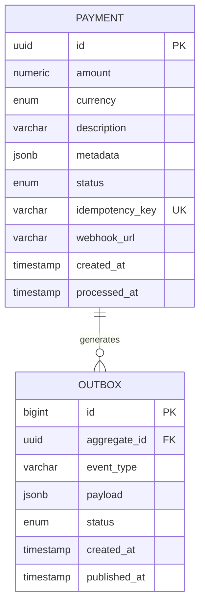

# Модели: Payment Processing Microservice

## Обзор

Две основные модели для реализации Outbox Pattern:
- **Payment** — платежи
- **Outbox** — события для гарантированной доставки в RabbitMQ

---

## Payment

### Назначение

Хранит информацию о платежах и их статусах.

### Файл

`app/models/payment.py`

### Схема таблицы

| Поле | Тип PostgreSQL | Тип Python | Параметры | Описание |
|------|----------------|------------|-----------|----------|
| id | UUID | UUID | PRIMARY KEY | Уникальный идентификатор платежа |
| amount | NUMERIC(10, 2) | Decimal | NOT NULL | Сумма платежа (до 8 цифр до запятой, 2 после) |
| currency | ENUM | Currency | NOT NULL | Валюта (RUB, USD, EUR) |
| description | VARCHAR(500) | str | NOT NULL | Описание платежа |
| metadata | JSONB | dict | NOT NULL, DEFAULT {} | Дополнительные данные (JSON) |
| status | ENUM | PaymentStatus | NOT NULL, DEFAULT 'pending' | Статус (pending, succeeded, failed) |
| idempotency_key | VARCHAR(255) | str | NOT NULL, UNIQUE | Ключ идемпотентности |
| webhook_url | VARCHAR(2048) | str | NOT NULL | URL для webhook-уведомлений |
| created_at | TIMESTAMP | datetime | NOT NULL, DEFAULT NOW() | Дата создания |
| processed_at | TIMESTAMP | datetime | NULLABLE | Дата обработки |

### Индексы

```sql
CREATE UNIQUE INDEX idx_payment_idempotency_key ON payments(idempotency_key);
CREATE INDEX idx_payment_status ON payments(status);
CREATE INDEX idx_payment_created_at ON payments(created_at DESC);
```

**Обоснование:**
- `idempotency_key` — уникальный индекс для быстрой проверки дублей
- `status` — для фильтрации по статусу (например, поиск pending платежей)
- `created_at` — для сортировки и пагинации

### Constraints

```sql
ALTER TABLE payments
  ADD CONSTRAINT check_amount_positive CHECK (amount > 0);
```

### Enums

#### PaymentStatus

```python
from enum import Enum

class PaymentStatus(str, Enum):
    PENDING = "pending"      # Ожидает обработки
    SUCCEEDED = "succeeded"  # Успешно обработан
    FAILED = "failed"        # Обработка завершилась ошибкой
```

**PostgreSQL ENUM:**
```sql
CREATE TYPE payment_status AS ENUM ('pending', 'succeeded', 'failed');
```

#### Currency

```python
from enum import Enum

class Currency(str, Enum):
    RUB = "RUB"  # Российский рубль
    USD = "USD"  # Доллар США
    EUR = "EUR"  # Евро
```

**PostgreSQL ENUM:**
```sql
CREATE TYPE currency AS ENUM ('RUB', 'USD', 'EUR');
```

### SQLAlchemy модель

```python
from sqlalchemy import Column, String, Numeric, Enum as SQLEnum, DateTime, CheckConstraint
from sqlalchemy.dialects.postgresql import UUID, JSONB
from sqlalchemy.sql import func
from app.db.base import Base
import uuid

class Payment(Base):
    __tablename__ = "payments"
    
    id = Column(
        UUID(as_uuid=True),
        primary_key=True,
        default=uuid.uuid4,
        nullable=False
    )
    amount = Column(
        Numeric(precision=10, scale=2),
        nullable=False
    )
    currency = Column(
        SQLEnum(Currency, name="currency"),
        nullable=False
    )
    description = Column(
        String(500),
        nullable=False
    )
    metadata = Column(
        JSONB,
        nullable=False,
        default=dict
    )
    status = Column(
        SQLEnum(PaymentStatus, name="payment_status"),
        nullable=False,
        default=PaymentStatus.PENDING
    )
    idempotency_key = Column(
        String(255),
        nullable=False,
        unique=True,
        index=True
    )
    webhook_url = Column(
        String(2048),
        nullable=False
    )
    created_at = Column(
        DateTime(timezone=True),
        nullable=False,
        server_default=func.now()
    )
    processed_at = Column(
        DateTime(timezone=True),
        nullable=True
    )
    
    __table_args__ = (
        CheckConstraint('amount > 0', name='check_amount_positive'),
    )
    
    def __repr__(self):
        return f"<Payment(id={self.id}, status={self.status}, amount={self.amount})>"
```

### Бизнес-правила

1. **Сумма должна быть положительной** — проверяется через CHECK constraint
2. **Idempotency key уникален** — гарантируется UNIQUE constraint
3. **Статус по умолчанию = pending** — устанавливается при создании
4. **processed_at устанавливается только после обработки** — NULL для pending платежей
5. **metadata всегда валидный JSON** — гарантируется типом JSONB

### Валидация на уровне приложения

```python
from pydantic import BaseModel, Field, HttpUrl, condecimal
from decimal import Decimal

class PaymentCreate(BaseModel):
    amount: condecimal(gt=Decimal(0), decimal_places=2)
    currency: Currency
    description: str = Field(min_length=1, max_length=500)
    metadata: dict = Field(default_factory=dict)
    webhook_url: HttpUrl
```

---

## Outbox

### Назначение

Хранит события для гарантированной публикации в RabbitMQ (Outbox Pattern).

### Файл

`app/models/outbox.py`

### Схема таблицы

| Поле | Тип PostgreSQL | Тип Python | Параметры | Описание |
|------|----------------|------------|-----------|----------|
| id | BIGSERIAL | int | PRIMARY KEY | Автоинкрементный ID |
| aggregate_id | UUID | UUID | NOT NULL | ID агрегата (payment_id) |
| event_type | VARCHAR(100) | str | NOT NULL | Тип события (payment.created) |
| payload | JSONB | dict | NOT NULL | Данные события (JSON) |
| status | ENUM | OutboxStatus | NOT NULL, DEFAULT 'pending' | Статус (pending, published) |
| created_at | TIMESTAMP | datetime | NOT NULL, DEFAULT NOW() | Дата создания |
| published_at | TIMESTAMP | datetime | NULLABLE | Дата публикации |

### Индексы

```sql
CREATE INDEX idx_outbox_status ON outbox(status) WHERE status = 'pending';
CREATE INDEX idx_outbox_created_at ON outbox(created_at DESC);
CREATE INDEX idx_outbox_aggregate_id ON outbox(aggregate_id);
```

**Обоснование:**
- `status` — partial index для быстрого поиска pending событий
- `created_at` — для сортировки и очистки старых событий
- `aggregate_id` — для поиска событий конкретного платежа

### Enums

#### OutboxStatus

```python
from enum import Enum

class OutboxStatus(str, Enum):
    PENDING = "pending"      # Ожидает публикации
    PUBLISHED = "published"  # Опубликовано в RabbitMQ
```

**PostgreSQL ENUM:**
```sql
CREATE TYPE outbox_status AS ENUM ('pending', 'published');
```

### SQLAlchemy модель

```python
from sqlalchemy import Column, String, BigInteger, Enum as SQLEnum, DateTime
from sqlalchemy.dialects.postgresql import UUID, JSONB
from sqlalchemy.sql import func
from app.db.base import Base

class Outbox(Base):
    __tablename__ = "outbox"
    
    id = Column(
        BigInteger,
        primary_key=True,
        autoincrement=True
    )
    aggregate_id = Column(
        UUID(as_uuid=True),
        nullable=False,
        index=True
    )
    event_type = Column(
        String(100),
        nullable=False
    )
    payload = Column(
        JSONB,
        nullable=False
    )
    status = Column(
        SQLEnum(OutboxStatus, name="outbox_status"),
        nullable=False,
        default=OutboxStatus.PENDING
    )
    created_at = Column(
        DateTime(timezone=True),
        nullable=False,
        server_default=func.now()
    )
    published_at = Column(
        DateTime(timezone=True),
        nullable=True
    )
    
    def __repr__(self):
        return f"<Outbox(id={self.id}, event_type={self.event_type}, status={self.status})>"
```

### Формат payload

```json
{
  "payment_id": "550e8400-e29b-41d4-a716-446655440000",
  "idempotency_key": "client-key-123",
  "created_at": "2026-04-20T10:00:00Z"
}
```

### Бизнес-правила

1. **Событие создаётся в той же транзакции, что и Payment** — гарантирует консистентность
2. **Статус по умолчанию = pending** — устанавливается при создании
3. **published_at устанавливается только после успешной публикации** — NULL для pending
4. **Старые опубликованные события периодически удаляются** — через scheduled task

### Жизненный цикл события

```
1. Payment создан → Outbox запись создана (status=pending)
2. Outbox Publisher читает pending события
3. Событие публикуется в RabbitMQ
4. Статус обновляется на published, устанавливается published_at
5. Через 7 дней событие удаляется (cleanup task)
```

---

## Связи между моделями



**Связь:**
- Один Payment может генерировать одно или несколько Outbox событий
- `outbox.aggregate_id` ссылается на `payment.id` (логическая связь, без FK constraint)

**Почему нет FK constraint:**
- Outbox события могут относиться к разным агрегатам (не только Payment)
- Упрощает удаление старых Payment без каскадного удаления событий
- Outbox — технический паттерн, не бизнес-связь

---

## Миграции Alembic

### Создание таблиц

**Файл:** `alembic/versions/001_create_payments_and_outbox.py`

```python
"""Create payments and outbox tables

Revision ID: 001
Revises: 
Create Date: 2026-04-20 10:00:00
"""
from alembic import op
import sqlalchemy as sa
from sqlalchemy.dialects import postgresql

# revision identifiers
revision = '001'
down_revision = None
branch_labels = None
depends_on = None

def upgrade():
    # Create enums
    op.execute("CREATE TYPE payment_status AS ENUM ('pending', 'succeeded', 'failed')")
    op.execute("CREATE TYPE currency AS ENUM ('RUB', 'USD', 'EUR')")
    op.execute("CREATE TYPE outbox_status AS ENUM ('pending', 'published')")
    
    # Create payments table
    op.create_table(
        'payments',
        sa.Column('id', postgresql.UUID(as_uuid=True), primary_key=True),
        sa.Column('amount', sa.Numeric(precision=10, scale=2), nullable=False),
        sa.Column('currency', postgresql.ENUM('RUB', 'USD', 'EUR', name='currency'), nullable=False),
        sa.Column('description', sa.String(500), nullable=False),
        sa.Column('metadata', postgresql.JSONB, nullable=False, server_default='{}'),
        sa.Column('status', postgresql.ENUM('pending', 'succeeded', 'failed', name='payment_status'), nullable=False, server_default='pending'),
        sa.Column('idempotency_key', sa.String(255), nullable=False, unique=True),
        sa.Column('webhook_url', sa.String(2048), nullable=False),
        sa.Column('created_at', sa.DateTime(timezone=True), nullable=False, server_default=sa.func.now()),
        sa.Column('processed_at', sa.DateTime(timezone=True), nullable=True),
        sa.CheckConstraint('amount > 0', name='check_amount_positive')
    )
    
    # Create indexes for payments
    op.create_index('idx_payment_idempotency_key', 'payments', ['idempotency_key'], unique=True)
    op.create_index('idx_payment_status', 'payments', ['status'])
    op.create_index('idx_payment_created_at', 'payments', [sa.text('created_at DESC')])
    
    # Create outbox table
    op.create_table(
        'outbox',
        sa.Column('id', sa.BigInteger, primary_key=True, autoincrement=True),
        sa.Column('aggregate_id', postgresql.UUID(as_uuid=True), nullable=False),
        sa.Column('event_type', sa.String(100), nullable=False),
        sa.Column('payload', postgresql.JSONB, nullable=False),
        sa.Column('status', postgresql.ENUM('pending', 'published', name='outbox_status'), nullable=False, server_default='pending'),
        sa.Column('created_at', sa.DateTime(timezone=True), nullable=False, server_default=sa.func.now()),
        sa.Column('published_at', sa.DateTime(timezone=True), nullable=True)
    )
    
    # Create indexes for outbox
    op.create_index('idx_outbox_status', 'outbox', ['status'], postgresql_where=sa.text("status = 'pending'"))
    op.create_index('idx_outbox_created_at', 'outbox', [sa.text('created_at DESC')])
    op.create_index('idx_outbox_aggregate_id', 'outbox', ['aggregate_id'])

def downgrade():
    op.drop_table('outbox')
    op.drop_table('payments')
    op.execute('DROP TYPE outbox_status')
    op.execute('DROP TYPE currency')
    op.execute('DROP TYPE payment_status')
```

### Применение миграций

```bash
# Создать миграцию
alembic revision --autogenerate -m "Create payments and outbox tables"

# Применить миграции
alembic upgrade head

# Откатить миграцию
alembic downgrade -1
```

---

## Размер данных и производительность

### Оценка размера Payment

| Поле | Размер |
|------|--------|
| id (UUID) | 16 байт |
| amount (NUMERIC) | ~8 байт |
| currency (ENUM) | 4 байта |
| description (VARCHAR) | ~100 байт (средний) |
| metadata (JSONB) | ~200 байт (средний) |
| status (ENUM) | 4 байта |
| idempotency_key | ~40 байт |
| webhook_url | ~100 байт (средний) |
| created_at | 8 байт |
| processed_at | 8 байт |
| **Итого** | **~488 байт** |

**1 млн платежей ≈ 488 МБ** (без учёта индексов)

### Оценка размера Outbox

| Поле | Размер |
|------|--------|
| id (BIGINT) | 8 байт |
| aggregate_id (UUID) | 16 байт |
| event_type | ~20 байт |
| payload (JSONB) | ~150 байт (средний) |
| status (ENUM) | 4 байта |
| created_at | 8 байт |
| published_at | 8 байт |
| **Итого** | **~214 байт** |

**1 млн событий ≈ 214 МБ** (без учёта индексов)

### Рекомендации по производительности

1. **Партиционирование** (при росте > 10 млн записей):
   - Партиционирование payments по created_at (по месяцам)
   - Партиционирование outbox по created_at (по дням)

2. **Архивирование**:
   - Перемещать старые payments (> 1 год) в архивную таблицу
   - Удалять опубликованные outbox события (> 7 дней)

3. **Connection pooling**:
   - Использовать asyncpg с pool_size=20, max_overflow=10

4. **Vacuum**:
   - Настроить autovacuum для частого обновления outbox
